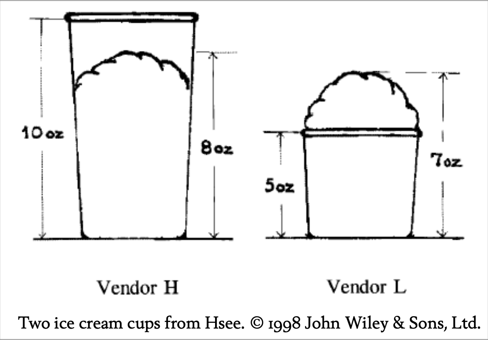

## 可评估性（以及便宜的节日购物）

作者：Eliezer Yudkowsky

随着“万圣节-感恩节-圣诞节”高消费季节的到来，读者们心中一定浮现出一个重要的问题：

> “亲爱的 Overcoming Bias，我能不能利用某些认知偏差，看起来很慷慨，其实却不用花太多钱？”

我很高兴地告诉你：答案是可以的！根据Hsee的一篇论文《Less is Better》所说，如果你送别人一条价值45美元的围巾，你看起来会比送一件55美元的大衣还要慷慨。1

这是一个更普遍现象的特例。在更早的一项实验中，Hsee请被试估算他们愿意为一本二手音乐词典支付多少费用：2

* A词典：1993年出版，包含10,000个词条，品相近新；
* B词典：1993年出版，包含20,000个词条，封面有破损，其他方面也近新。

关键在于，有些被试是同时看到这两本词典的，而有些则只看到其中一本……

只看到一本词典的被试，愿意为A词典支付平均24美元，而为B词典支付平均20美元；
而看到两本词典并列比较的被试，则愿意为B词典支付27美元，为A词典支付19美元。

当然，如果你真的打算用这本词典，词条数量远比封面是否破损更重要。但如果你面前只有一本词典，而它有20,000个词条，“20,000”这个数字对你来说可能毫无意义——是多？是少？谁知道呢？它是**不可评估的（non-evaluable）**。而“破损封面”却不一样，那是明显的、带有负面情感的特征。

但当你把两本词典并排比较时，词条数量就从不可评估变成可评估了，因为有了可以直接对比的量级。而一旦词条数量变得可评估，它的重要性就会压倒封面破损这一特征。

再来看Slovic等人的研究：你更倾向于哪一个选项？3

1. 29/36 的概率赢得2美元；
2. 7/36 的概率赢得9美元。

虽然这两个选项的平均估价分别是1.25美元和2.11美元，但它们的**吸引力评分**却分别是13.2和7.5。在实验中，受试者知道会从他们打分的赌局中随机挑两个，并实际玩那个被估价更高或评分更高的赌局（因此他们有动机去提升自己真正偏好的选项的得分）。

也就是说，虽然第二个赌局的价值更高，但人们觉得它**不那么吸引人**——这就是经典的**偏好反转（preference reversal）**。研究人员猜测，美元金额更适合估价任务，但中奖概率更适合吸引力评分。于是他们思考：能不能让赌局的金额更具情感吸引力——也就是说，更容易被“评估”？

他们的做法是：在原本的赌局中加入一个**非常小的损失**。
原赌局是：7/36 概率赢得9美元。
新赌局是：7/36 概率赢得9美元，**29/36 概率损失5美分**。

原赌局让你仅仅对9美元做情感评估，而新赌局则让你在“赢9美元”和“亏5美分”之间做情感权衡。

Slovic等人说：“结果远超我们的预期。”
在新实验中，原赌局（仅有9美元奖励）的平均吸引力评分为 **9.4**，而加入5美分损失后的新赌局吸引力评分飙升至 **14.9**。

随后他们进行了另一项实验，比较赌局和确定赢得2美元之间的偏好。只有33%的学生选择原赌局。而在另一组中，面对“确定赢2美元”与“新赌局”（包含可能亏5美分），竟有 **60.8%** 选择了后者。毕竟，9美元可能本身不吸引人，但与5美分相对比，这个“赢/亏比”显得极其吸引人。

你没看错：\*\*你可以通过加入一个明确的损失，让赌局变得更吸引人！\*\*心理学是不是特别有趣？这也是为什么，没人愿意认真面对人类智能的复杂性时，还想要去构建一个真正类人的AI。

当然，这一切前提是：受试者**不能看到两个赌局的并列比较**。

类似地，你觉得上图中的两份冰淇淋，哪一份更受欢迎？这是Hsee在1998年研究中的例子。

显然，答案取决于受试者是否看到两份冰淇淋**并排展示**。
只看到单独一份冰淇淋的受试者，愿意为Vendor H支付1.66美元，为Vendor L支付2.26美元；
看到两者并排的受试者，则愿意为Vendor H支付1.85美元，为Vendor L支付1.56美元。

那么这对你的节日购物意味着什么？
如果你花400美元买一个16GB的iPod Touch，收礼者会觉得那是**最昂贵的MP3播放器**；
如果你花400美元买一个Nintendo Wii，他们则会觉得那是**最便宜的游戏主机**。
哪一个性价比更高？这个问题只有在**同时看到两个产品**时才有意义。
你在购物时会并列思考这些，但收礼的人只会看到他们**实际拿到的东西**。

所以，如果你有固定的预算，而且你的目标是**展示你的友情**，而不是实质性地帮助收礼人——你最好**故意不要去追求性价比**。
先决定你想花多少钱让人印象深刻，然后找一个在这个价位中**最无价值的东西**。
在相同的预算下，越“便宜”品类中的物品看起来越贵重。
比如25美元的衬衫和25美元的蜡烛——哪个更令人印象深刻？

这让日本人送50美元哈密瓜的习俗，瞬间变得合理了，是不是？
你看着会摇头：“日本人怎么想的？”但实际上，他们能用50美元就显得极其慷慨、甚至挥霍。
你可能花200美元请一顿高档晚餐，都未必显得像他们花50美元买个哈密瓜那么“有钱”。
如果能有送25美元牙签或10美元灰尘的习俗，他们还能花得更少！

**附注：如果你真的用了这个技巧，请告诉我你买了什么。**

---

1Christopher K. Hsee, “Less Is Better: When Low-Value Options Are Valued More Highly than High-Value Options,” Behavioral Decision Making 11 (2 1998): 107–121. 

2Christopher K. Hsee, “The Evaluability Hypothesis: An Explanation for Preference Reversals between Joint and Separate Evaluations of Alternatives,” Organizational Behavior and Human Decision Processes 67 (3 1996): 247–257. 

3Slovic et al., “Rational Actors or Rational Fools.”

---

## Evaluability (and Cheap Holiday Shopping)

by Eliezer Yudkowsky

With the expensive part of the Hallowthankmas season now approaching, a question must be looming large in our readers’ minds:

> “Dear Overcoming Bias, are there biases I can exploit to be seen as generous without actually spending lots of money?”

I’m glad to report the answer is yes! According to Hsee—in a paper entitled “Less is Better”—if you buy someone a \$45 scarf, you are more likely to be seen as generous than if you buy them a \$55 coat.1

This is a special case of a more general phenomenon. In an earlier experiment, Hsee asked subjects how much they would be willing to pay for a second-hand music dictionary:2

- Dictionary A, from 1993, with 10,000 entries, in like-new condition.
- Dictionary B, from 1993, with 20,000 entries, with a torn cover and otherwise in like-new condition.
The gotcha was that some subjects saw both dictionaries side-by-side, while other subjects only saw one dictionary . . .

Subjects who saw only one of these options were willing to pay an average of \$24 for Dictionary A and an average of \$20 for Dictionary B. Subjects who saw both options, side-by-side, were willing to pay \$27 for Dictionary B and \$19 for Dictionary A.

Of course, the number of entries in a dictionary is more important than whether it has a torn cover, at least if you ever plan on using it for anything. But if you’re only presented with a single dictionary, and it has 20,000 entries, the number 20,000 doesn’t mean very much. Is it a little? A lot? Who knows? It’s non-evaluable. The torn cover, on the other hand—that stands out. That has a definite affective valence: namely, bad.

Seen side-by-side, though, the number of entries goes from non-evaluable to evaluable, because there are two compatible quantities to be compared. And once the number of entries becomes evaluable, that facet swamps the importance of the torn cover.

From Slovic et al.: Which would you prefer?3

1. A 29/36 chance to win \$2. 
2. A 7/36 chance to win \$9.

While the average prices (equivalence values) placed on these options were \$1.25 and \$2.11 respectively, their mean attractiveness ratings were 13.2 and 7.5. Both the prices and the attractiveness rating were elicited in a context where subjects were told that two gambles would be randomly selected from those rated, and they would play the gamble with the higher price or higher attractiveness rating. (Subjects had a motive to rate gambles as more attractive, or price them higher, that they would actually prefer to play.)

The gamble worth more money seemed less attractive, a classic preference reversal. The researchers hypothesized that the dollar values were more compatible with the pricing task, but the probability of payoff was more compatible with attractiveness. So (the researchers thought) why not try to make the gamble’s payoff more emotionally salient—more affectively evaluable—more attractive?

And how did they do this? By adding a very small loss to the gamble. The old gamble had a 7/36 chance of winning \$9. The new gamble had a 7/36 chance of winning \$9 and a 29/36 chance of losing 5 cents. In the old gamble, you implicitly evaluate the attractiveness of \$9. The new gamble gets you to evaluate the attractiveness of winning \$9 versus losing 5 cents.

“The results,” said Slovic et al., “exceeded our expectations.” In a new experiment, the simple gamble with a 7/36 chance of winning \$9 had a mean attractiveness rating of 9.4, while the complex gamble that included a 29/36 chance of losing 5 cents had a mean attractiveness rating of 14.9.

A follow-up experiment tested whether subjects preferred the old gamble to a certain gain of \$2. Only 33% of students preferred the old gamble. Among another group asked to choose between a certain \$2 and the new gamble (with the added possibility of a 5 cents loss), fully 60.8% preferred the gamble. After all, \$9 isn’t a very attractive amount of money, but \$9 / 5 cents is an amazingly attractive win/loss ratio.

You can make a gamble more attractive by adding a strict loss! Isn’t psychology fun? This is why no one who truly appreciates the wondrous intricacy of human intelligence wants to design a human-like AI.

Of course, it only works if the subjects don’t see the two gambles side-by-side.

Similarly, which of the two ice creams in Figure 1 do you think subjects in Hsee’s 1998 study preferred?

Naturally, the answer depends on whether the subjects saw a single ice cream, or the two side-by-side. Subjects who saw a single ice cream were willing to pay \$1.66 to Vendor H and \$2.26 to Vendor L. Subjects who saw both ice creams were willing to pay \$1.85 to Vendor H and \$1.56 to Vendor L.

What does this suggest for your holiday shopping? That if you spend \$400 on a 16GB iPod Touch, your recipient sees the most expensive MP3 player. If you spend \$400 on a Nintendo Wii, your recipient sees the least expensive game machine. Which is better value for the money? Ah, but that question only makes sense if you see the two side-by-side. You’ll think about them side-by-side while you’re shopping, but the recipient will only see what they get.

If you have a fixed amount of money to spend—and your goal is to display your friendship, rather than to actually help the recipient—you’ll be better off deliberately not shopping for value. Decide how much money you want to spend on impressing the recipient, then find the most worthless object which costs that amount. The cheaper the class of objects, the more expensive a particular object will appear, given that you spend a fixed amount. Which is more memorable, a \$25 shirt or a \$25 candle?

Gives a whole new meaning to the Japanese custom of buying \$50 melons, doesn’t it? You look at that and shake your head and say “What is it with the Japanese?” And yet they get to be perceived as incredibly generous, spendthrift even, while spending only \$50. You could spend \$200 on a fancy dinner and not appear as wealthy as you can by spending \$50 on a melon. If only there was a custom of gifting \$25 toothpicks or \$10 dust specks; they could get away with spending even less.

PS: If you actually use this trick, I want to know what you bought.

---

1Christopher K. Hsee, “Less Is Better: When Low-Value Options Are Valued More Highly than High-Value Options,” Behavioral Decision Making 11 (2 1998): 107–121.

2Christopher K. Hsee, “The Evaluability Hypothesis: An Explanation for Preference Reversals between Joint and Separate Evaluations of Alternatives,” Organizational Behavior and Human Decision Processes 67 (3 1996): 247–257.

3Slovic et al., “Rational Actors or Rational Fools.”