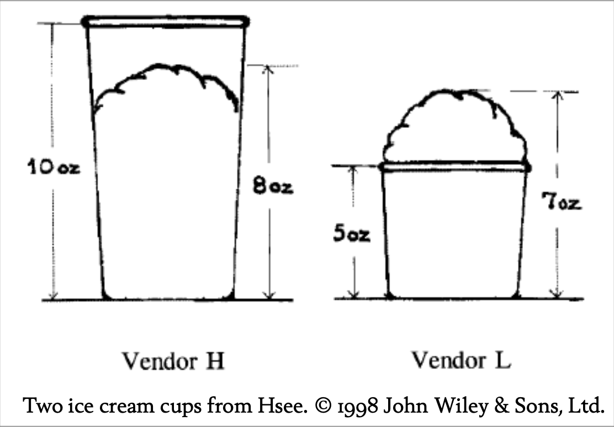

## 可评估性（以及廉价的节日购物）

随着“万圣感恩圣诞季”中最烧钱的部分即将到来，读者们心中一定浮现出这样一个问题：

　　“亲爱的 Overcoming Bias，有没有什么偏见可以让我看起来很慷慨，但实际上不用花很多钱？”

很高兴告诉你，答案是肯定的！根据 Hsee 的一篇论文《少即是多》，如果你送别人一条价值45美元的围巾，对方会觉得你比送一件价值55美元的大衣还要慷慨。1

这其实是一个更普遍现象的特例。在更早的一个实验中，Hsee 让受试者估算他们愿意为一本二手音乐词典支付多少钱：2

- 词典A，1993年版，收录1万个词条，品相近乎全新。
- 词典B，1993年版，收录2万个词条，封面有破损，其余近乎全新。

关键在于，有些受试者是把两本词典并排看到的，有些受试者只看到其中一本……

只看到一本词典的受试者，愿意为A支付平均24美元，为B支付平均20美元。并排看到两本词典的受试者，愿意为B支付27美元，为A支付19美元。

当然，如果你真的要用词典，词条数量比封面是否破损重要得多。但如果你只看到一本词典，2万个词条这个数字其实没什么意义——到底多还是少？谁知道呢？这是“不可评估”的。而封面破损则很显眼，带来明确的负面情感。

但如果两本词典并排出现，词条数量就从不可评估变成可评估，因为有了对比。一旦词条数量变得可评估，这一维度的重要性就远超封面破损。

再看 Slovic 等人的例子：你更喜欢哪一个？3

1. 29/36 的概率赢2美元。
2. 7/36 的概率赢9美元。

虽然这两种选择的平均“价格”（等价价值）分别是1.25美元和2.11美元，但它们的平均吸引力评分分别是13.2和7.5。两项评分都是在受试者被告知“会随机选两项赌博，玩价格或吸引力评分更高的那项”的前提下给出的（也就是说，受试者有动力把自己更想玩的赌博评分打高）。

价值更高的赌博反而看起来没那么吸引人，这就是经典的“偏好反转”。研究者猜测，金额更适合用来定价，而中奖概率更适合用来评估吸引力。于是他们想：为什么不让赌博的奖金更有情感吸引力——更容易被评估、更有吸引力呢？

他们怎么做的？只需在赌博中加一个极小的损失。原本的赌博是7/36概率赢9美元。新赌博是7/36概率赢9美元，29/36概率亏5美分。原本你只是在评估赢9美元的吸引力，新赌博则让你评估“赢9美元”与“亏5美分”之间的对比。

Slovic 等人说：“结果超出了我们的预期。”新实验中，单纯7/36赢9美元的赌博吸引力评分为9.4，而加了29/36亏5美分的新赌博吸引力评分高达14.9。

后续实验测试受试者是否更愿意选原赌博还是确定获得2美元。只有33%的学生选原赌博。而在另一组中，面对“确定2美元”与“新赌博（可能亏5美分）”的选择，竟有60.8%的人选了新赌博。毕竟，9美元本身没那么吸引人，但“9美元/5美分”的赢亏比就极具吸引力。

你可以通过加一个确定的损失，让赌博变得更有吸引力！心理学是不是很有趣？这也是为什么真正懂得人类智能复杂性的人，不会想设计类人AI。

当然，这一切只有在受试者没把两种赌博并排比较时才成立。

同样，Hsee 1998年研究中的两个冰淇淋，你觉得受试者更喜欢哪一个？

答案当然取决于受试者是只看到一个冰淇淋，还是把两个并排看到。只看到一个时，受试者愿意为H摊主的冰淇淋付1.66美元，为L摊主的付2.26美元。并排看到时，愿意为H摊主的付1.85美元，为L摊主的付1.56美元。

这对你的节日购物有什么启示？如果你花400美元买个16GB的iPod Touch，收礼人会觉得这是最贵的MP3播放器。如果你花400美元买个任天堂Wii，收礼人会觉得这是最便宜的游戏机。哪个更值？只有并排比较时这个问题才有意义。你购物时会并排比较，但收礼人只会看到自己收到的那件东西。

如果你有固定的预算——而你的目标是展示友谊，而不是实际帮助对方——那你最好别刻意追求性价比。先决定你想花多少钱让对方印象深刻，然后找一个最不值钱但价格正好合适的东西。某个类别越便宜，花同样的钱买到的单品就越显得贵。25美元的衬衫和25美元的蜡烛，哪个更让人记住？

这也让日本人买50美元一个的哈密瓜有了全新意义。你看到会摇头：“日本人怎么这样？”但他们只花50美元，就能被认为极其慷慨、甚至奢侈。你花200美元请人吃大餐，都不如花50美元买个哈密瓜显得有钱。如果有送25美元牙签或10美元灰尘的习俗，他们还能花得更少。

PS：如果你真的用这个技巧，记得告诉我你买了什么。

---

1Hsee, “Less Is Better,” 1998.

2Hsee, “The Evaluability Hypothesis,” 1996.

3Slovic 等, “Rational Actors or Rational Fools,” 2002.

---

## Evaluability (and Cheap Holiday Shopping)

With the expensive part of the Hallowthankmas season now approaching, a question must be looming large in our readers’ minds:

	“Dear Overcoming Bias, are there biases I can exploit to be seen as generous without actually spending lots of money?”

I’m glad to report the answer is yes! According to Hsee—in a paper entitled “Less is Better”—if you buy someone a $45 scarf, you are more likely to be seen as generous than if you buy them a $55 coat.1

This is a special case of a more general phenomenon. In an earlier experiment, Hsee asked subjects how much they would be willing to pay for a second-hand music dictionary:2

- Dictionary A, from 1993, with 10,000 entries, in like-new condition.
- Dictionary B, from 1993, with 20,000 entries, with a torn cover and otherwise in like-new condition.

The gotcha was that some subjects saw both dictionaries side-by-side, while other subjects only saw one dictionary . . .

Subjects who saw only one of these options were willing to pay an average of $24 for Dictionary A and an average of $20 for Dictionary B. Subjects who saw both options, side-by-side, were willing to pay $27 for Dictionary B and $19 for Dictionary A.

Of course, the number of entries in a dictionary is more important than whether it has a torn cover, at least if you ever plan on using it for anything. But if you’re only presented with a single dictionary, and it has 20,000 entries, the number 20,000 doesn’t mean very much. Is it a little? A lot? Who knows? It’s non-evaluable. The torn cover, on the other hand—that stands out. That has a definite affective valence: namely, bad.

Seen side-by-side, though, the number of entries goes from non-evaluable to evaluable, because there are two compatible quantities to be compared. And once the number of entries becomes evaluable, that facet swamps the importance of the torn cover.

From Slovic et al.: Which would you prefer?3

1. A 29/36 chance to win $2.
2. A 7/36 chance to win $9.

While the average prices (equivalence values) placed on these options were $1.25 and $2.11 respectively, their mean attractiveness ratings were 13.2 and 7.5. Both the prices and the attractiveness rating were elicited in a context where subjects were told that two gambles would be randomly selected from those rated, and they would play the gamble with the higher price or higher attractiveness rating. (Subjects had a motive to rate gambles as more attractive, or price them higher, that they would actually prefer to play.)

The gamble worth more money seemed less attractive, a classic preference reversal. The researchers hypothesized that the dollar values were more compatible with the pricing task, but the probability of payoff was more compatible with attractiveness. So (the researchers thought) why not try to make the gamble’s payoff more emotionally salient—more affectively evaluable—more attractive?

And how did they do this? By adding a very small loss to the gamble. The old gamble had a 7/36 chance of winning $9. The new gamble had a 7/36 chance of winning $9 and a 29/36 chance of losing 5 cents. In the old gamble, you implicitly evaluate the attractiveness of $9. The new gamble gets you to evaluate the attractiveness of winning $9 versus losing 5 cents.

“The results,” said Slovic et al., “exceeded our expectations.” In a new experiment, the simple gamble with a 7/36 chance of winning $9 had a mean attractiveness rating of 9.4, while the complex gamble that included a 29/36 chance of losing 5 cents had a mean attractiveness rating of 14.9.

A follow-up experiment tested whether subjects preferred the old gamble to a certain gain of $2. Only 33% of students preferred the old gamble. Among another group asked to choose between a certain $2 and the new gamble (with the added possibility of a 5 cents loss), fully 60.8% preferred the gamble. After all, $9 isn’t a very attractive amount of money, but $9 / 5 cents is an amazingly attractive win/loss ratio.

You can make a gamble more attractive by adding a strict loss! Isn’t psychology fun? This is why no one who truly appreciates the wondrous intricacy of human intelligence wants to design a human-like AI.

Of course, it only works if the subjects don’t see the two gambles sideby-side.

Similarly, which of the two ice creams in Figure 1 do you think subjects in Hsee’s 1998 study preferred?

Naturally, the answer depends on whether the subjects saw a single ice cream, or the two side-by-side. Subjects who saw a single ice cream were willing to pay $1.66 to Vendor H and $2.26 to Vendor L. Subjects who saw both ice creams were willing to pay $1.85 to Vendor H and $1.56 to Vendor L.

What does this suggest for your holiday shopping? That if you spend $400 on a 16GB iPod Touch, your recipient sees the most expensive MP3 player. If you spend $400 on a Nintendo Wii, your recipient sees the least expensive game machine. Which is better value for the money? Ah, but that question only makes sense if you see the two side-by-side. You’ll think about them side-by-side while you’re shopping, but the recipient will only see what they get.

If you have a fixed amount of money to spend—and your goal is to display your friendship, rather than to actually help the recipient—you’ll be better off deliberately not shopping for value. Decide how much money you want to spend on impressing the recipient, then find the most worthless object which costs that amount. The cheaper the class of objects, the more expensive a particular object will appear, given that you spend a fixed amount. Which is more memorable, a $25 shirt or a $25 candle?

Gives a whole new meaning to the Japanese custom of buying $50 melons, doesn’t it? You look at that and shake your head and say “What is it with the Japanese?” And yet they get to be perceived as incredibly generous, spendthrift even, while spending only $50. You could spend $200 on a fancy dinner and not appear as wealthy as you can by spending $50 on a melon. If only there was a custom of gifting $25 toothpicks or $10 dust specks; they could get away with spending even less.

PS: If you actually use this trick, I want to know what you bought.

---

1Hsee, “Less Is Better,” 1998.

1Hsee, “The Evaluability Hypothesis,” 1996.

3Slovic et al., “Rational Actors or Rational Fools,” 2002.