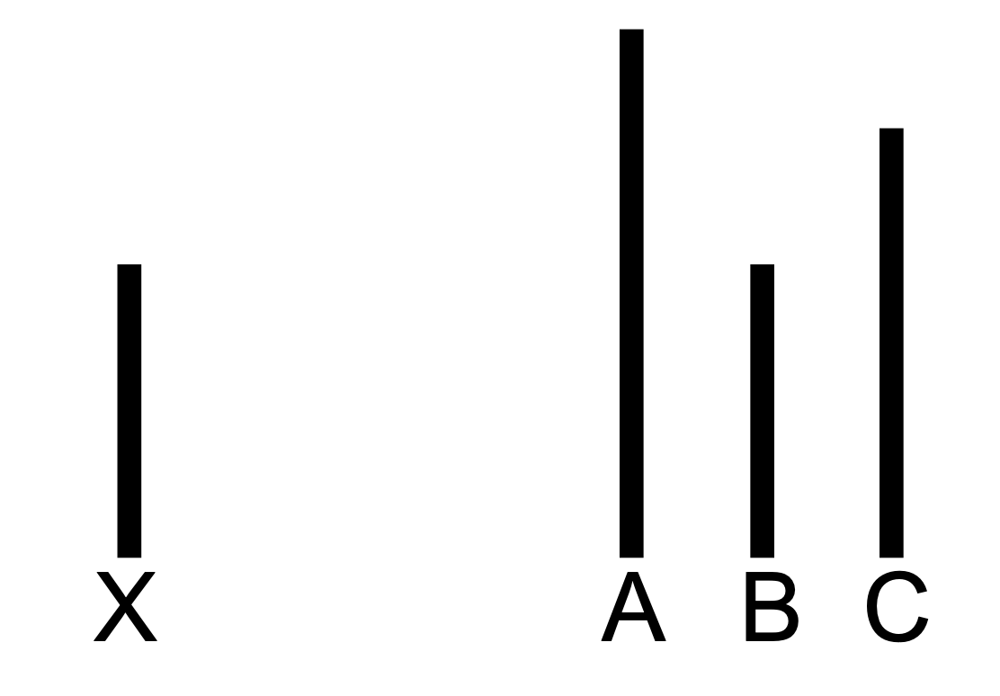

## 阿希的从众实验

所罗门·阿希（Solomon Asch）在20世纪50年代进行的实验（后来被多次重复验证）揭示了一种现象，如今被称为“从众”。在经典实验中，受试者会看到类似下图的题目：A、B、C三条线中，哪一条和X一样长？请你先自己判断一下答案……

关键在于，受试者是和其他几个人一起看图的——这些人看似也是受试者，实际上是实验者的同伙。实验中，其他“受试者”一个接一个地说C和X一样长。真正的受试者坐在倒数第二位。在这种情况下，有多少人会选择“C”——即给出一个明显错误但与其他人一致的答案？你觉得比例会是多少？

阿希实验中，四分之三的受试者至少有一次给出了“从众”答案。三分之一的受试者超过一半时间都选择了从众。

实验后的访谈显示，大多数受试者声称自己其实并不相信那个从众答案，但也有一些人说他们真的认为从众选项才是正确的。

阿希对这些结果感到不安：1

　　我们发现社会中的从众倾向如此之强……这令人担忧。这引发了对我们教育方式和指导我们行为的价值观的质疑。

阿希实验的受试者是否表现得非理性，这并不是个简单的问题。罗伯特·奥曼（Robert Aumann）的“协议定理”表明，诚实的贝叶斯主义者不能“同意不同意”——如果他们对概率估计有共同知识，最终会得出相同的概率估计。奥曼的协议定理是在阿希实验二十多年后才被证明的，但它只是形式化并强化了一个直观的观点——他人的信念往往是合理的证据。

如果你看到类似上面的图，并且你确信其他人也在看同一张图且都很诚实，且有三个人说C和X一样长，那么只有你一个人是对的概率有多大？我自认在视觉判断上并不比普通人强。如果是个人理性，我希望自己能注意到自己的极度困惑，然后把大于50%的概率分配给多数人的选择。

从群体理性的角度来看，诚实的理性主义者应该说：“真奇怪，我觉得B和X一样长。但如果我们都在看同一张图且都诚实报告，我没有理由认为自己的判断比你们更好。”最后这句话很重要——这是一种比“哦，我看出这是错觉了——我理解你们为什么选C，但真正的答案是B”要弱得多的分歧表达。

所以，单凭这些描述，实验中的从众者并不能自动被判定为非理性。但正如你所料，细节才是关键。Smith 和 Bond 对一百多次重复实验的元分析显示……2

……从众率在同伙人数增加到3人时显著上升，但从3人到10–15人时并不会进一步增加。如果人们是理性地从众，那么15个人的意见应该比3个人的意见更有说服力。

只要有一个异见者——哪怕只是给出正确答案，或者给出与大多数人不同的错误答案——从众率就会大幅下降，只剩5–10%的受试者会从众。如果你用奥曼协议的直觉版本来思考，认为1个人反对3个人时，3个人大概率是对的，那么大多数情况下你也应该同样认为2个人反对6个人时，6个人更可能对。3 另一方面，如果人们只是因为害怕成为异类而紧张，那么只要有另一个人和你意见一致，或者哪怕只是有另一个人和大多数人意见不同，你就会轻松很多。

不出所料，在有一个异见者的情况下，受试者并不认为自己的非从众行为是受到了异见者的影响或启发。就像90%的司机认为自己在前50%一样，也许有些人确实如此，但不可能所有人都对。人们并不自知自己从众或反从众的原因，这也削弱了“从众模式是理性的”这种说法的说服力。4

当唯一的异见者突然转而顺从大多数时，受试者的从众率又回升到和没有异见者时一样高。成为第一个异见者是一项宝贵（且代价高昂！）的社会服务，但你必须坚持下去。

在所有实验中，纯女性小组（女性受试者和女性同伙）比纯男性小组的从众率显著更高。大约一半女性超过一半时间选择从众，而男性只有三分之一。如果你认为平均受试者是理性的，那么显然女性太容易同意，男性太容易反对，所以两组其实都不理性……

内群体-外群体操控（比如残障受试者和其他残障同伙一起）也显示，内群体成员之间的从众率显著更高。

在非常明显的图形（比如本篇开头的那种）中，从众率较低，而在更微妙的图形中，从众率更高。如果所有受试者都是为了避免出头而做出社会理性决策，这种现象就很难解释。

最后，Paul Crowley 提醒我指出：当受试者可以用不会被他人看到的方式作答时，从众率也会下降，这同样不支持奥曼式的解释。

---

1Asch, “Studies of Independence and Conformity: A Minority of One Against a Unanimous Majority,” 1956.

2Bond and Smith, “Culture and Conformity: A Meta-Analysis of Studies Using Asch’s (1952b, 1956) Line Judgment Task,” 1996.

3这不是绝对成立，但在其他条件相同的情况下成立。

4比如，在“人们是出于社会理性选择撒谎以避免出头”这个假说下，至少有些有异见者的受试者并不会有意识地预见到自己在面对一致反对时会采取的“有意识策略”。

---

## Asch’s Conformity Experiment

Solomon Asch, with experiments originally carried out in the 1950s and wellreplicated since, highlighted a phenomenon now known as “conformity.” In the classic experiment, a subject sees a puzzle like the one in the nearby diagram: Which of the lines A, B, and C is the same size as the line X ? Take a moment to determine your own answer . . .

The gotcha is that the subject is seated alongside a number of other people looking at the diagram—seemingly other subjects, actually confederates of the experimenter. The other “subjects” in the experiment, one after the other, say that line C seems to be the same size as X. The real subject is seated next-to-last. How many people, placed in this situation, would say “C”—giving an obviously incorrect answer that agrees with the unanimous answer of the other subjects? What do you think the percentage would be?

Three-quarters of the subjects in Asch’s experiment gave a “conforming” answer at least once. A third of the subjects conformed more than half the time.

Interviews after the experiment showed that while most subjects claimed to have not really believed their conforming answers, some said they’d really thought that the conforming option was the correct one.

Asch was disturbed by these results:1

	That we have found the tendency to conformity in our society so strong . . . is a matter of concern. It raises questions about our ways of education and about the values that guide our conduct.

It is not a trivial question whether the subjects of Asch’s experiments behaved irrationally. Robert Aumann’s Agreement Theorem shows that honest Bayesians cannot agree to disagree—if they have common knowledge of their probability estimates, they have the same probability estimate. Aumann’s Agreement Theorem was proved more than twenty years after Asch’s experiments, but it only formalizes and strengthens an intuitively obvious point—other people’s beliefs are often legitimate evidence.

If you were looking at a diagram like the one above, but you knew for a fact that the other people in the experiment were honest and seeing the same diagram as you, and three other people said that C was the same size as X, then what are the odds that only you are the one who’s right? I lay claim to no advantage of visual reasoning—I don’t think I’m better than an average human at judging whether two lines are the same size. In terms of individual rationality, I hope I would notice my own severe confusion and then assign >50% probability to the majority vote.

In terms of group rationality, seems to me that the proper thing for an honest rationalist to say is, “How surprising, it looks to me like B is the same size as X. But if we’re all looking at the same diagram and reporting honestly, I have no reason to believe that my assessment is better than yours.” The last sentence is important—it’s a much weaker claim of disagreement than, “Oh, I see the optical illusion—I understand why you think it’s C, of course, but the real answer is B.”

So the conforming subjects in these experiments are not automatically convicted of irrationality, based on what I’ve described so far. But as you might expect, the devil is in the details of the experimental results. According to a meta-analysis of over a hundred replications by Smith and Bond . . .2

. . . Conformity increases strongly up to 3 confederates, but doesn’t increase further up to 10–15 confederates. If people are conforming rationally, then the opinion of 15 other subjects should be substantially stronger evidence than the opinion of 3 other subjects.

Adding a single dissenter—just one other person who gives the correct answer, or even an incorrect answer that’s different from the group’s incorrect answer—reduces conformity very sharply, down to 5–10% of subjects. If you’re applying some intuitive version of Aumann’s Agreement to think that when 1 person disagrees with 3 people, the 3 are probably right, then in most cases you should be equally willing to think that 2 people will disagree with 6 people.3 On the other hand, if you’ve got people who are emotionally nervous about being the odd one out, then it’s easy to see how adding a single other person who agrees with you, or even adding a single other person who disagrees with the group, would make you much less nervous.

Unsurprisingly, subjects in the one-dissenter condition did not think their nonconformity had been influenced or enabled by the dissenter. Like the 90% of drivers who think they’re above-average in the top 50%, some of them may be right about this, but not all. People are not self-aware of the causes of their conformity or dissent, which weighs against any attempts to argue that the patterns of conformity are rational.4

When the single dissenter suddenly switched to conforming to the group, subjects’ conformity rates went back up to just as high as in the no-dissenter condition. Being the first dissenter is a valuable (and costly!) social service, but you’ve got to keep it up.

Consistently within and across experiments, all-female groups (a female subject alongside female confederates) conform significantly more often than all-male groups. Around one-half the women conform more than half the time, versus a third of the men. If you argue that the average subject is rational, then apparently women are too agreeable and men are too disagreeable, so neither group is actually rational . . .

Ingroup-outgroup manipulations (e.g., a handicapped subject alongside other handicapped subjects) similarly show that conformity is significantly higher among members of an ingroup.

Conformity is lower in the case of blatant diagrams, like the one at the beginning of this essay, versus diagrams where the errors are more subtle. This is hard to explain if (all) the subjects are making a socially rational decision to avoid sticking out.

Finally, Paul Crowley reminds me to note that when subjects can respond in a way that will not be seen by the group, conformity also drops, which also argues against an Aumann interpretation.

---

1Asch, “Studies of Independence and Conformity: A Minority of One Against a Unanimous Majority,” 1956.

2Bond and Smith, “Culture and Conformity: A Meta-Analysis of Studies Using Asch’s (1952b, 1956) Line Judgment Task,” 1996.

3This isn’t automatically true, but it’s true ceteris paribus.

4For example, in the hypothesis that people are socially-rationally choosing to lie in order to not stick out, it appears that (at least some) subjects in the one-dissenter condition do not consciously anticipate the “conscious strategy” they would employ when faced with unanimous opposition.

